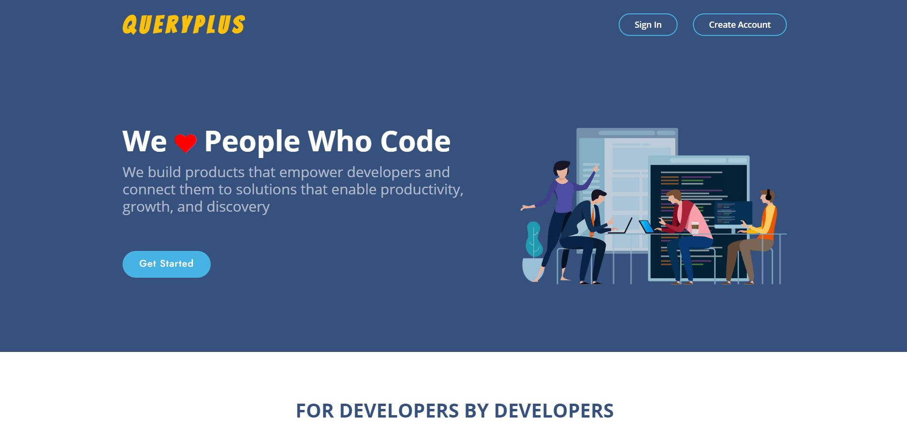
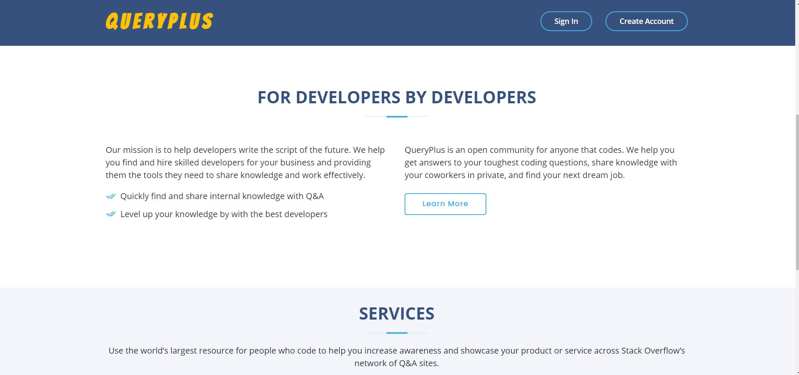
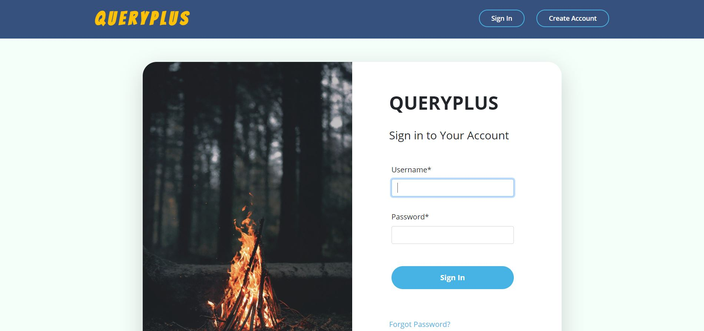
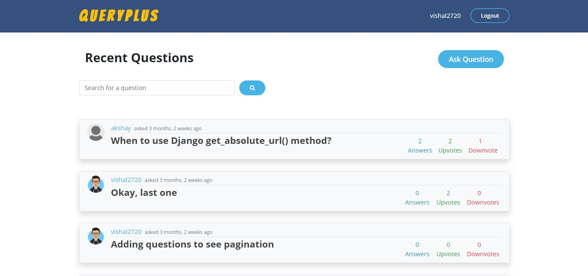
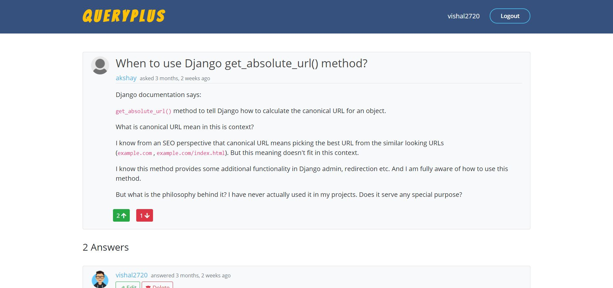
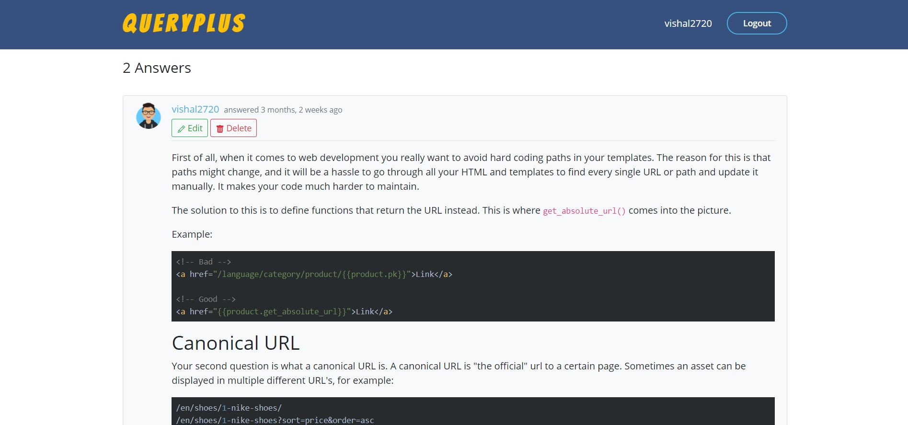
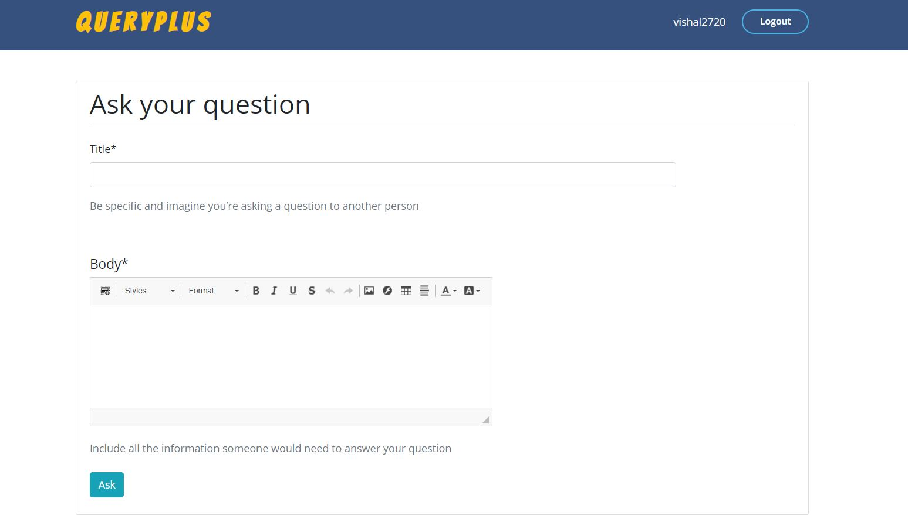

# QueryPlus

[](https://www.djangoproject.com/)
[](https://code.visualstudio.com/  "Visual Studio Code")

QueryPlus is a Q&amp;A platform specially made for developers where they can post questions and answers.

## Getting Started

The first thing to do is to clone the repository:

```sh
$ git clone https://github.com/gocardless/sample-django-app.git
$ cd sample-django-app
```

Setup project environment with [virtualenv](https://virtualenv.pypa.io) and [pip](https://pip.pypa.io).

```bash
$ virtualenv project-env
$ source project-env/bin/activate
$ pip install -r https://raw.githubusercontent.com/juanifioren/django-project-template/master/requirements.txt

# You may want to change the name `projectname`.
$ django-admin startproject --template https://github.com/juanifioren/django-project-template/archive/master.zip projectname

$ cd projectname/
$ cp settings_custom.py.edit settings_custom.py
$ python manage.py migrate
$ python manage.py runserver
```

## Tech Stack 

* Frontend: HTML, CSS, JS, Bootstrap4
* Backend: Python3
* Framework: Django
* Database: sqlite

## Features

* QueryPlus is Q&A platform where users can post questions and answers.
* Users can also upvote or downvote a particular question or answer.
* Users can register and create/update their profile.
* There is CKEditor plugin integration, so if you write some code in your question/answer
it will be posted with proper syntax highlighting for that language.

---

## QueryPlus Screenshots

<div align="center">
<h4 align="center">Homepage</h4>

<br>

<br>
<h4 align="center">Sign In Page</h4>

<br>
<h4 align="center">Questions Page</h4>

<br>
<h4 align="center">Question Detail Page</h4>

<br>
<h4 align="center">Answer Detail</h4>

<br>
<h4 align="center">Ask Question</h4>

<br>
</div>

---

## Contributing

I love contributions, so please feel free to fix bugs, improve things, provide documentation. Just send a pull request.
